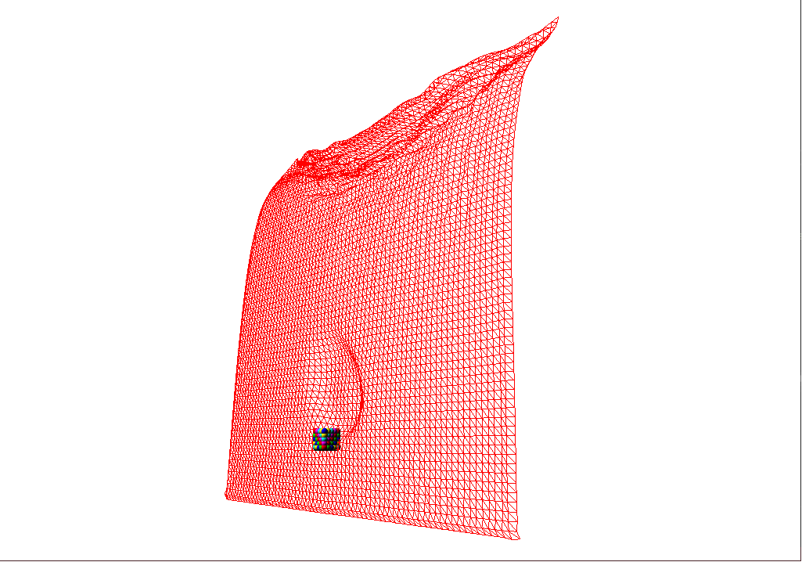

---
author:
- Miłosz Woźny, Adam Żyliński
bibliography:
- bibliography.bib
date: June 2024
nocite: "[@*]"
title: Position Based Dynamics
---

# Introduction

Our goal was to create a physics simulation based on a particle model
that can model various phenomena in a simple and eye-pleasing way. The
idea was to create rigid body, cloth and fluid simulation where physics
laws would be enforced with a set of constraints between particles that
sample bodies present in a given scene. Calculating and applying those
constraints, as well as stepping the simulation forward would be
accelerated using NVIDIA GPU CUDA architecture. By using particles as a
base of the simulation world complex phenomena can be broken down into a
lot of simple interactions between individual particles that together
add up to a reasonable approximation. The physical scene is visualised
in a simple rendering engine written in OpenGL. We have achieved a
partial success - we created a framework for implementing scenes where
individual particles, cloth, and larger bodies can interact with each
other, sadly we did not finish a full rigid body simulation and we did
not start working on the fluids.

# Theoretical introduction

The theoretical foundation of our simulation is based on [@main] for
additional information we highly recommend checking it.

## Simulation world

We represent a physical scene with a set of $N$ particles that all have
a mass $m$, a position $x$, and a velocity $v$. We are going to progress
the simulation using a following scheme:

1. Find new positions of particles by applying external forces
    (gravity) and then using Euler integration formula

2. Find and generate particle-particle and particle-surface collision
    constraints based on new positions of particles

3. Solve all constraints in groups (grouped by types of constraints)
    and apply offsets to new positions

4. Update positions and velocities using positions corrected in the
    previous step

## Constraints

The basis of our simulation are constraints that keep the physical laws
satisfied. A constraint is an object that contains:

1. A cardinality $n_j$ - number of particles affected by a given
    constraint

2. A function $C : \mathbb{R}^{3n_j} \rightarrow \mathbb{R}$

3. a set of indices ${i_i, ..., i_{n_j}}$

4. a stiffness parameter $k \in [0...1]$

5. a type - either an equality or an inequality

A constraint is satisfied if $C(x_{i_1}, ..., x_{i_{n_j}}) = 0$, or in
case of an inequality - $C(x_{i_1}, ..., x_{i_{n_j}}) \leq 0$. Let's say
we are given an equality constraint of cardinality n, restricting
position change along the constraint gradient and scaling it by the
inverse mass of the particle yields:
$$\Delta {x_i} = \lambda w_i \frac{\partial C}{\partial {x_i}}$$
with $\lambda$ as a displacement scaling factor:
$$\lambda = \frac{-C}{w_1|\frac{\partial C}{\partial {x_1}}| + ... + w_n|\frac{\partial C}{\partial {x_n}}|},$$
where $C$ is a value of the constraint function, $w_1, ..., w_n$ are the
inverse masses of particles affected by this constraint, and
${x_1}, ..., {x_n}$ are the positions of those particles. Keep
in mind that the term $\frac{\partial C}{\partial {x_i}}$ is a
partial derivative of a vector function with respect to a vector, it
yields a vector.

Adding this displacement to each of the particle position results in C
being satisfied in the next time step. It seems desirable, but it
creates a visible \"jittering\" effect that is especially noticeable in
colliding bodies. To address this issue, we multiply $\Delta {x_i}$
by a parameter $k \in [0 ... 1]$ to give a smoother correction effect.
In case of inequalities we clamp the value such that $\lambda \neq 0$ if
and only if the inequality is not satisfied. The types of constraints
used in our simulations are:

1. Distance constraint - keeps two particles of indicies i and j at a
    certain distance $d$ from each other. The constraint function is as
    follows:
   $$C(d, x_i, x_j) = d - dist(x_i, x_j)$$
   where $dist(x_i, x_j)$ is a distance between particle i and j.

2. Surface constraint - keeps a particle at a certain distance $d$ from
    the surface S. The constraint function is as follows:
    $C(d, S, x) = d - dist(S, x)$ where $dist(S, x)$ is a distance
    between the surface S and a particle. If we represent a surface as
    four floating point values $(a, b, c, d)$ as in the equation:
    $$ax + by + cz + d = 0$$
     then our distance function becomes:
    $$dist(S, x) = \frac{|ax + by + cz + d|}{\sqrt(a^2 + b^2 + c^2)}.$$
    It is also useful to store the surface normal so it does not have to
    be recalculated each time it is needed.

3. Friction constraint - this could be described more as a constraint
    modification than a constraint on it's own. It can be applied
    alongside distance or surface constraint to simulate friction. It
    takes the calculated change in position and projects it on a vector
    that's perpendicular to the normal vector of the collision creating
    ${\Delta x_{\perp}}$. Then we can compute the output of the
    force that will be generated thanks to friction using:
    $$\Delta x_i = \frac{w_i}{w_i + w_j} \Delta x_\perp  \text{if } |{\Delta x_\perp}| < \mu_s d$$
    $$\Delta x_i = \frac{w_i}{w_i + w_j} \Delta x_\perp \cdot min(\frac{\mu_k d}{|\Delta x_{\perp}|}, 1)  \text{otherwise }$$
    where $\mu_s$ and $\mu_k$ are respectively static and dynamic friction constants.

4. Rigid body constraint - keeps the rigid body shape intact. External
    forces and other constraints might change our rigid body and
    transform it into a deformed shape. To counteract this changes we
    need to compute the deformed shape's covariance matrix:
    $$A = \sum_{i=0}^n (x_{i}^* - {c}) \cdot {r_{i}^T}$$
    where $c$ is the center of mass in the current configuration
    and $r_i$ is the particle's offset from the center of mass in
    the starting configuration. The algorithm is described at
    [@polar-theory] and implemented at [@polar-implement]. Afterwords we
    use polar decomposition:
    $$A = QR$$
    and generate the rotation matrix ${Q}$. Finally we can compute the output using:
    $$\Delta  x_i = \alpha (({Qr_i} +  c) -  x^*_i)$$
    where $\alpha$ is a scaling parameter. In our case values
    $\approx 0.7$ gave the best results.

## Constraint solver

Our physics engine is based on a constraint solver that as an input
takes a set of constraints imposed on particles present in the scene:
$$C_i(x + \Delta x) = 0, i = 1,...,n$$
$$C_j(x + \Delta x) \geq 0, j = 1,...,n$$
We can get a good approximation of the solution by
linearizing C around x:
$$C_i(x + \Delta x) \approx C_i(x) + \nabla C_i(x)\Delta x$$
We can also look at position based dynamics as a constraint
optimization problem:
$$\text{minimize:    }  \frac{1}{2} {\Delta x^T M \Delta x}$$ 
$$\text{subject to:   } {J \Delta x = b}$$
where ${J} = \nabla C(x)$ and
${b} = [-C_1, ..., -C_n]^T$. It can be further transformed to
$${M \Delta x = J^T \lambda}$$
$${J \Delta x = b}$$
Equations above can be derived from these conditions (considering
the equation for a single constraint) and eliminating ${\Delta x}$
yields:
$$\left[{JM^{-1}J^T}\right]{\lambda = b}$$
which is a system of linear equations - solving it gives a solution for a displacement of
particles with respect to n constraints.

# Our work

## Solution overview

A particle in our simulation is represented as following:

```c++
struct particle{
    float3 pos; 
    float3 new_pos; 
    float3 v; 
    float inv_mass;
};
```

In every step of the simulation we update the position of each particle
using the following algorithm:

```c++
while(true)
{
    for(particle p in particles) 
    {
        p.new_pos += (p.v + F_ext) \* dt;
    }
    // findCollisions(particles); 
    for(i = 0 ... iterations) 
    {
        // solve all constraints -> dpos; 
        // update the particles p.new_pos += dpos;
    }
    for(particle p in particles)
    {
        p.v = (p.new_pos - p.pos)/dt;
        if(|p.new_pos - p.pos| > EPS) p.new_pos = p.pos;
    } 
}
```

## Collisions

Collision handling is one of the most important components of the
simulation. We distinguish 2 types of collisions:

-   particle - particle collision

-   particle - surface collision

To handle both of them we need to generate distance constraints
dynamically: add at the moment of collision and erase them upon losing
contact.

### Constraint solving

Solving a constraint results in generating ${\Delta x}$. However
this change might cause a different constraint to be violated. Iterating
multiple times over those constraints partially solves this problem. For
maximum efficiency we want to solve the constraints in parallel (Jacobi
method). This creates new problems. For example when there are two
identical distance constraints placed on a particle the final position
of the particle is going to fluctuate between
($x_{cor} - d, x_{cor} + d$), where $x_{cor}$ is the correct position.
To address this we can apply under-relaxation:
$${\Delta \tilde x} = \frac{{\Delta x}}{n}$$
where $n$ is the
number of constraints that affect this particle. Another idea is to
solve the constraints in groups and apply the position change after each
one. One more big issue that comes from using the Jacobi method is that
speed of convergence is relatively small compared to other solving
methods. One way to deal with it is to apply successive over-relaxation
(SOR):
$${\Delta \tilde x} = \frac{{\omega \Delta x}}{n}$$
where $1 \leq \omega \leq 2$ is the relaxation parameter ($\omega = 1.5$
in our case).

## Implementation details

### Particle-particle collisions

To handle collisions in a efficient manner a uniform grid was created.
The grid tracks the position of each particle and during collision
checking we need to only check particles that are in the same or a
neighbouring cell. To avoid multiple detection of the same collision we
check only cells that have all x, y, z indexes greater or equal to the
current cell. The collisions are than added into a array of lists. The
index of the list is the id of the first particle and value of the node
is the second particle id.

```c++
for(particle p in particles)
{
    xIdx = AxisIndex(x[index]);
    yIdx = AxisIndex(y[index]);
    zIdx = AxisIndex(z[index]);
    maxX = min(xIdx + 1, (CUBESPERDIMENSION - 1));
    maxY = min(yIdx + 1, (CUBESPERDIMENSION - 1));
    maxZ = min(zIdx + 1, (CUBESPERDIMENSION - 1));
    for(i = xIdx ... maxX)
    {
        for(j = yIdx ... maxY)
        {
            for(k = zIdx ... maxZ)
            {
                for(particle q in cell(i, j, k))
                {
                    if (i == xIdx && j == yIdx && k == zIdx && p.id < q.id) continue;
                    if(p and q collide)
                    {
                        collisionList[p].addNode(q);    
                        collisionCount[index]++;
                    }
                }
            }
        }
    }
}
```

We also keep track of how many nodes are currently at each list in a
separate array. We then run a prefix sum algorithm to get the total
memory that should be reserved for constraints as well as find the
memory addresses where constraints from each list can be added in
parallel without conflicts and blank spaces. We need to remember to
clear the dynamic constraints array as well as the collision lists at
the beginning of each iteration.

### Particle-surface collisions

Since we kept a relatively low number of surfaces in each of our
simulation scenes (not greater than 5) we decided to calculate particle
collisions with each surface sequentially. To check whether a
surface-particle collision occurred we can first substitute the particle
center position into the surface equation, check the result sign, and
then based on the sign move the center point by a radius length in the
direction of the surface (surface normal) and substitute it into the
surface equation again.

```c++
float v1 = s.a * x[index] + s.b * y[index] + s.c * z[index] + s.d;
float sign = v1 < 0 ? -1 : 1;
float v2 = s.a * (x[index] - sign * s.normal[0] * r) + 
s.b * (y[index] - sign * s.normal[1] * r) + 
s.c * (z[index] - sign * s.normal[2] * r) + s.d;
if (v1 * v2 < 0) 
{
    // hit...
}
```

Opposite signs indicate that those two points lie on the opposite sides
of the surface, so a collision condition is met. We keep an array of
current collision indices (particle index \* surface index) and their
sign (which indicate from which side the particle came into contact with
the surface). A collision is removed in a future frame where it
re-enters a valid state (leaves the surface) what is indicated by the
sign of the surface equation being substituted by the particle position.

### Cloths

Cloths are a net of particles that are connected to each other using
equality distance constraints [@cloth].

<figure id="fig:4_node_cycle">
    
    <figcaption style="text-align: center;">A cloth is built out of many elements like the one above,
    where constraints between particles on the edges of the square keep the
    cloth from stretching, and the constraint on the diagonal keeps the
    cloth from bending into itself.</figcaption>
</figure>

If we want to fix the position of certain points of the cloth
(simulating attaching it to a wall or a pole) we can achieve it by
setting the inverse mass of some particles to 0 (rendering changes to
their position to be zeroed as well).

### Rigid bodies

Rigid bodies are groups of particles that are connected using one rigid
body constraint. The object is capable of keeping its shape. A
significant downside of our implementation is the lack of rotation
movements of the body. The body stays in the same orientation for the
whole duration of the simulation. Technically the rigid body constraint
works for any shape, we have tested it for cubes for simplicity.

# Results

We were able to create a framework that allows us to construct scenes
that include rigid bodies, cloths and free particles. We constructed a
few scenes that demonstrates capabilities of our program. We created
benchmarks for every scene on GeForce RTX 4060 and the results are shown
in table [\[benchmark\]](#benchmark){reference-type="ref"
reference="benchmark"}.

| Scene name           | $n^o$ particles cloth   | $n^o$ particles rigid body   | $n^o$ particles free   | $n^o$ constraints per frame | ms/frame average |
|----------------------|-------------------------|------------------------------|------------------------|-----------------------------|------------------|
| Cloth & wind         | 4900                    | 0                            | 0                      | $\sim$ 24K                  | 0.95             |
| Particles in a glass | 0                       | 0                            | 5000                   | $\sim$ 19K                  | 17.52            |
| Cloth covering       | 40 000                  | 64 000                       | 0                      | $\sim$ 60K                  | 12.12            |
| Rigid bodies stack   | 0                       | 8000                         | 0                      | $\sim$ 18K                  | 12.14            |
| Cloth trampoline     | 1200                    | 216                          | 0                      | $\sim$ 3600                 | 1.03             |

It turned out that a major bottleneck in our program was the
particle-particle collision detection algorithm. Pouring 5000 particles
into a limited space resulted in  19 000 collisions being handled per
frame which dropped frames per second below 60. When collision detection
was disabled, as in the Cloth & wind scene, we could handle about 60 000
collisions per frame before dropping frames.

<figure id="fig:fig">
<figure id="fig:sfig1">
<p> <span
id="fig:sfig1" label="fig:sfig1"></span></p>
</figure>
<figure id="fig:sfig2">
<p> <span
id="fig:sfig2" label="fig:sfig2"></span></p>
</figure>
<figure id="fig:sfig3">
<p> <span id="fig:sfig3"
label="fig:sfig3"></span></p>
</figure>
<figure id="fig:sfig4">
<p> <span id="fig:sfig4"
label="fig:sfig4"></span></p>
</figure>
<figure id="fig:sfig5">
<p> <span id="fig:sfig5"
label="fig:sfig5"></span></p>
</figure>
<figure id="fig:sfig6">
<p> <span id="fig:sfig6"
label="fig:sfig6"></span></p>
</figure>
<figcaption>Example scenes in the program. From the top left: (a) cloth
and body collision, (b) cloth on a slight wind, (c) cloth covering a
body, (d) fixed cloth catching a body. (e) rigid body stack before
collapse, (f) rigid body stack after collapse</figcaption>
</figure>

# Conclusions and future work

Sadly we did not finish the full scope of our project due to various
reasons. We have misinterpreted
[\[systemeq\]](#systemeq){reference-type="eqref" reference="systemeq"}
and various hints about solving the system in a \"Jacobi\" fashion, and
we thought that iterative methods for solving a system for linear
equations should be used. Only after implementing this solution and
failing to get satisfactory results did we realize that the equations
are meant to be solved directly.

We also made a few assumptions about the project that turned out to be
false. We thought that the matrix operations in the rigid body
constraint will take care of the body rotation by themselves, which is
seemingly not the case. We also tested rigid body collisions with signed
distance fields in hope this will fix some collision imperfections and
\"flying-through\" effects - but the only factor that helped us produce
more realistic scenes was adjusting constraint parameters.

The solver framework that we have implemented has a major flaw - number
of per-frame solver iterations, time-step size and constraint
coefficients are all dependent values. We decided to keep some of these
constant, but it is plausible that could have achieved better results
with different parameters. There is a method that seemingly promises
time-step and constraint strength decoupling called XPBD - we have
tested it briefly and we did not get any noticeable improvements so we
decided to stick with the original approach.

We have also experimented with techniques that were supposed to improve
stability like damping or stabilization iterations. The former lowered
the realism of the result, the latter was promising but too
computationally expensive. Finally we relied mostly on friction to
ensure stability throughout the simulation.

If we were to continue to work on the project, we would definitely look
into rigid body rotation first, because it would give our scenes more
realism. We would also like to look into increasing overall stability of
the simulation and researching the best combination of parameters. There
are also very interesting works regarding simulation of fluids and gases
using PBD [@fluids].

Applying Chebyshev semi-iterative method alongside the Jacobbi method,
as it was described in [@chebyshev], could also help the convergence of
our constraint solver, hence making the simulation more stable.

# Bibliography

1. Miles Macklin, Matthias Müller, Nuttapong Chentanez, and Tae-Yong Kim. Unified particle physics
for real-time applications. ACM Transactions on Graphics (TOG), 33(4):104, 2014.
2. Nicholas J. Higham and Vanni Noferini. An algorithm to compute the polar decomposition of a 3 ×
3 matrix. Numerical Algorithms, 73(2):349–369, 2015.
3. Polar decomposition 3x3. https://github.com/martinbis11/polar-decomposition-3x3, 2017.
4. Matthias Müller, Bruno Heidelberger, Marcus Hennix, and John Ratcliff. Position based dynam-
ics. In César Mendoza and Isabel Navazo, editors, Proceedings of the Third Workshop on Virtual
Reality Interactions and Physical Simulations, VRIPHYS 2006, Madrid, Spain, 2006, pages 71–80.
Eurographics Association, 2006.
5. Miles Macklin and Matthias Müller. Position based fluids. ACM Transactions on Graphics (TOG),
32(4):104, 2013.
6. Marco Fratarcangeli, Huamin Wang, and Yin Yang. Parallel iterative solvers for real-time elastic
deformations. In SIGGRAPH Asia 2018 Courses, SA ’18, New York, NY, USA, 2018. Association
for Computing Machinery.
7. Marco Fratarcangeli and Fabio Pellacini. A gpu-based implementation of position based dynamics
for interactive deformable bodies. Journal of Graphics Tools, 17(3):59–66, 2013.
